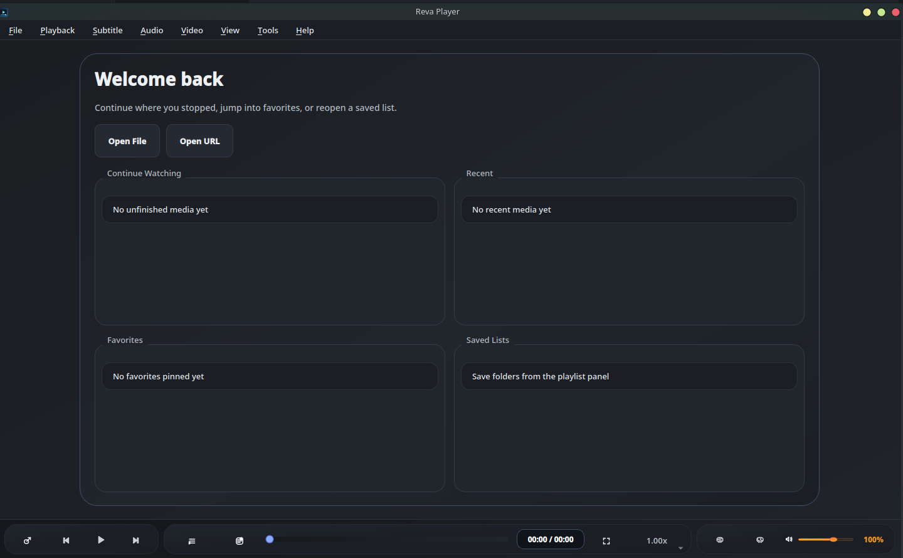
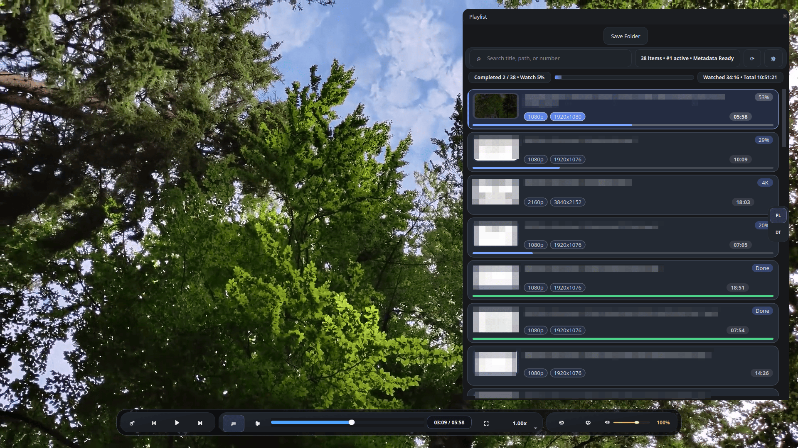
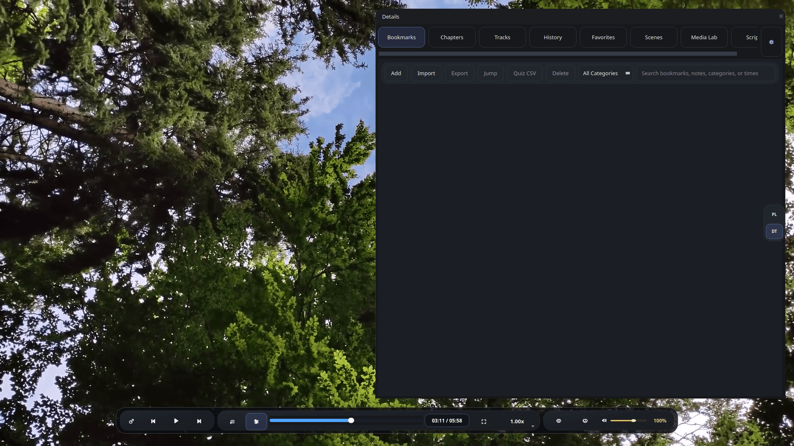
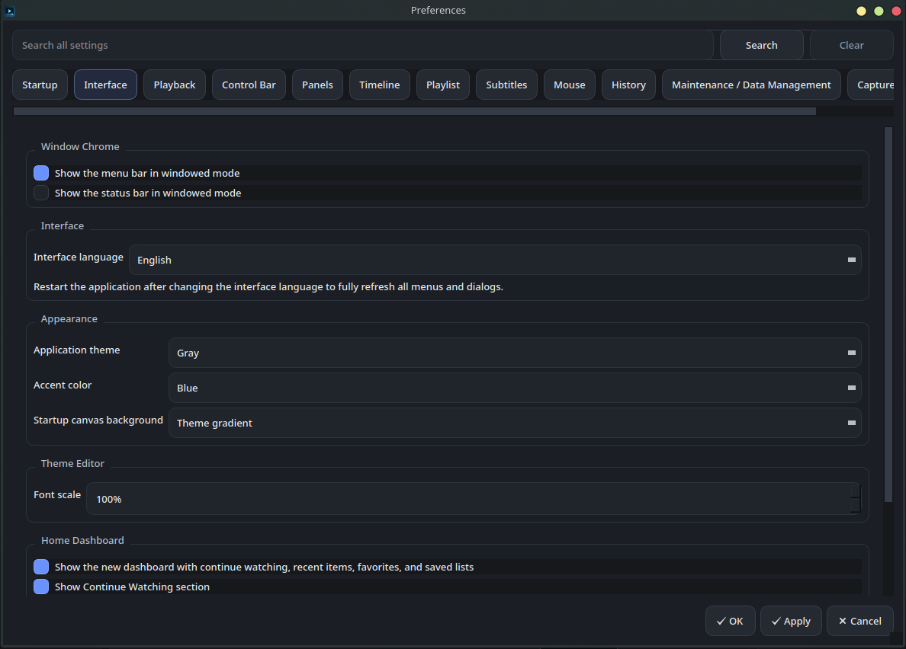

<p align="center">
  
</p>

# Reva Player

Reva Player is an open-source Linux desktop media player for people who spend
real time with local media: courses, lectures, recordings, playlists,
subtitle-heavy videos, long series, and folders they return to again and again.

It is built with Qt Widgets, libmpv, OpenGL rendering, and SQLite. The goal is a
native Linux player that feels fast and practical, while keeping a useful local
workspace around playback: playlists, saved folders, resume history, bookmarks,
subtitles, screenshots, thumbnails, and per-user settings.

Reva Player is free software licensed under the GNU General Public License,
version 2 or later (`GPL-2.0-or-later`). See [LICENSE](LICENSE).

Repository: [github.com/Moayad30/Reva_Player](https://github.com/Moayad30/Reva_Player)

## Preview

<p align="center">
  
</p>

<p align="center">
  
</p>

<p align="center">
  
</p>

<p align="center">
  
</p>

## Download

Ready-to-use Linux packages are published from
[GitHub Releases](https://github.com/Moayad30/Reva_Player/releases) when
available.

Typical release assets may include:

- AppImage for portable Linux testing.
- DEB for Debian/Ubuntu-family distributions.
- RPM for RPM-family distributions.

Download the package that fits your system, open your media, and keep your
playlists, progress, bookmarks, and subtitles organized in one local workspace.

## Quick Start

### AppImage

```bash
chmod +x RevaPlayer-v*.AppImage
./RevaPlayer-v*.AppImage
```

### DEB

```bash
sudo apt install ./reva-player_*.deb
RevaPlayer
```

### RPM

```bash
sudo dnf install ./reva-player-*.rpm
RevaPlayer
```

For package-specific notes, see [docs/packaging/README.md](docs/packaging/README.md).

## Why Reva Player

Most media players are excellent at opening a file and getting out of the way.
Reva Player is for the sessions that need more structure: a lecture series,
course folder, playlist, subtitle-heavy archive, long recording, or any local
media collection where remembering context matters.

- **A playback workspace, not just a video window.** Keep playlists, saved
  folders, history, bookmarks, thumbnails, screenshots, and settings together in
  one local desktop app.
- **Built around repeated viewing.** Continue where you left off, move through
  folders naturally, and keep useful viewing context across sessions.
- **Track progress across a playlist or series.** See completion across the
  current list, including watched time and total known duration when media
  metadata is available.
- **Serious subtitle controls.** Adjust visibility, timing, scale, position,
  language preferences, font behavior, and styling options from the app.
- **Bookmarks for real moments.** Save timestamps with titles, categories, and
  notes so important scenes, lessons, or references are easy to return to.
- **Power-user playback controls.** Use libmpv-backed playback with speed,
  volume, mute, repeat, seeking, track selection, aspect ratio, zoom, and pan.
- **Local-first by design.** No account, no cloud library, no media server
  requirement. Your playback state is stored locally in SQLite.
- **Native Linux distribution path.** The repository includes Linux desktop
  metadata and packaging paths for AppImage, DEB, and RPM-family systems.

## Feature Highlights

| Area | Purpose |
| --- | --- |
| Playback | Local video/audio playback through libmpv, plus media URLs supported by mpv. |
| Library workflow | File and folder playlists, saved folders, current-list context, and progress across a playlist or series. |
| Continuity | Local history, resume positions, watched duration, total known duration, window state, and playback preferences across sessions. |
| Bookmarks | Timestamped notes with title and category fields for returning to meaningful moments. |
| Subtitles | External subtitle loading, track selection, timing, style, scale, position, and language controls. |
| Viewing tools | Zoom, pan, aspect ratio, speed, repeat, screenshots, thumbnails, and configurable capture path. |
| Desktop integration | Linux desktop entry, AppStream metadata, scalable icon, and package-friendly install layout. |

## Built For Linux

Reva Player is focused exclusively on Linux desktop systems.

| Platform/package | Status |
| --- | --- |
| Linux source code | Supported |
| AppImage | Available |
| DEB | Available |
| RPM | Available |
| Flatpak | Not available yet |

Compatibility still depends on the target distribution, desktop environment,
GPU/OpenGL stack, audio stack, codecs, Qt plugins, and bundled or system libmpv
runtime. See [docs/COMPATIBILITY_MATRIX.md](docs/COMPATIBILITY_MATRIX.md) for
current packaging notes.

## Local Data

Reva Player stores application data locally. It does not require an online
account or online service.

Stored local data can include:

- Settings.
- Playback history.
- Resume positions.
- Bookmarks.
- Window/layout state.
- Saved folders and playlist-related preferences.
- Thumbnail/cache data.

For storage paths and cleanup notes, see
[docs/reference/STORAGE_PATHS.md](docs/reference/STORAGE_PATHS.md) and
[docs/reference/PURGE_LOCAL_DATA.md](docs/reference/PURGE_LOCAL_DATA.md).

## Release Notes

- [GitHub release text for v1.0.0](RELEASE_NOTES_v1.0.0.md)
- [Release build notes](docs/packaging/RELEASE_BUILDS.md)
- [Packaging overview](docs/packaging/README.md)

## Documentation

- [User Guide](docs/USER_GUIDE.md)
- [Packaging](docs/packaging/README.md)
- [QA Checklist](docs/QA_CHECKLIST.md)
- [Architecture](docs/ARCHITECTURE.md)
- [Third-party notices](THIRD_PARTY_NOTICES.md)

## Contributing

Reva Player is an open-source Linux desktop project. Contributions, feedback,
testing, and practical improvements are welcome.

## License

Reva Player is licensed under `GPL-2.0-or-later`.

Binary release packages may include or depend on third-party runtime components
such as Qt, libmpv, FFmpeg, SQLite, D-Bus, and desktop integration libraries.
See [THIRD_PARTY_NOTICES.md](THIRD_PARTY_NOTICES.md).
